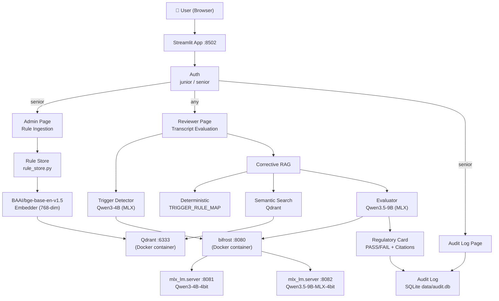
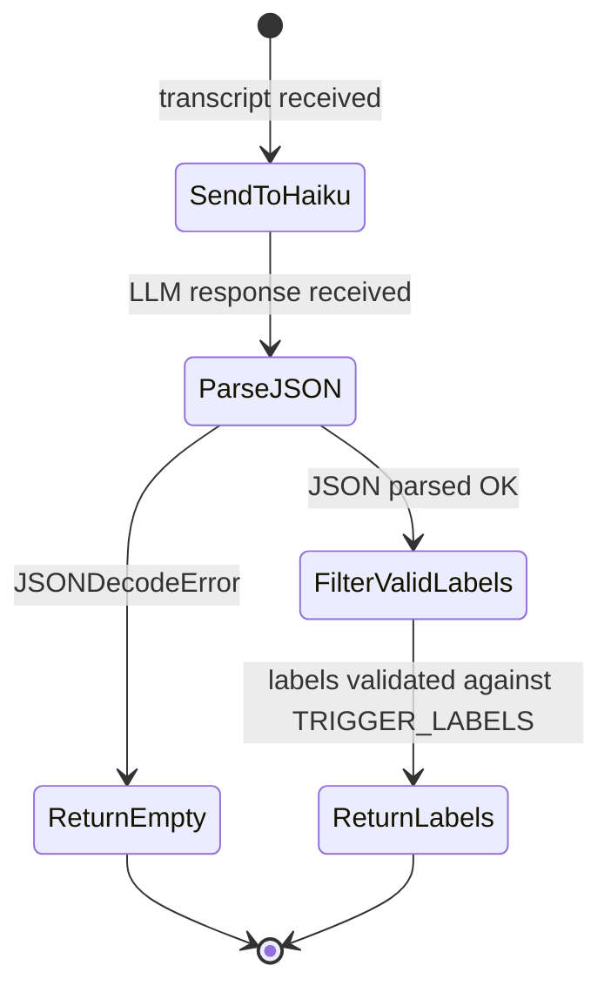
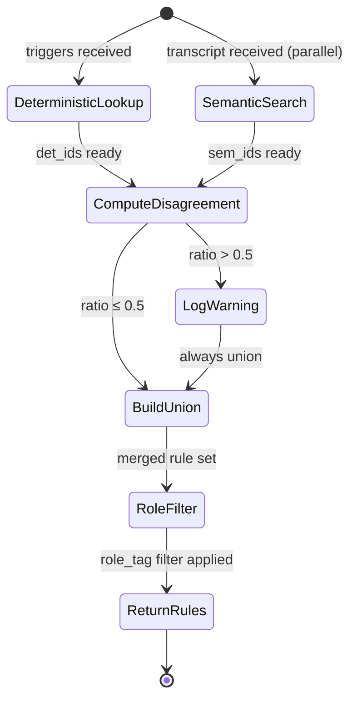
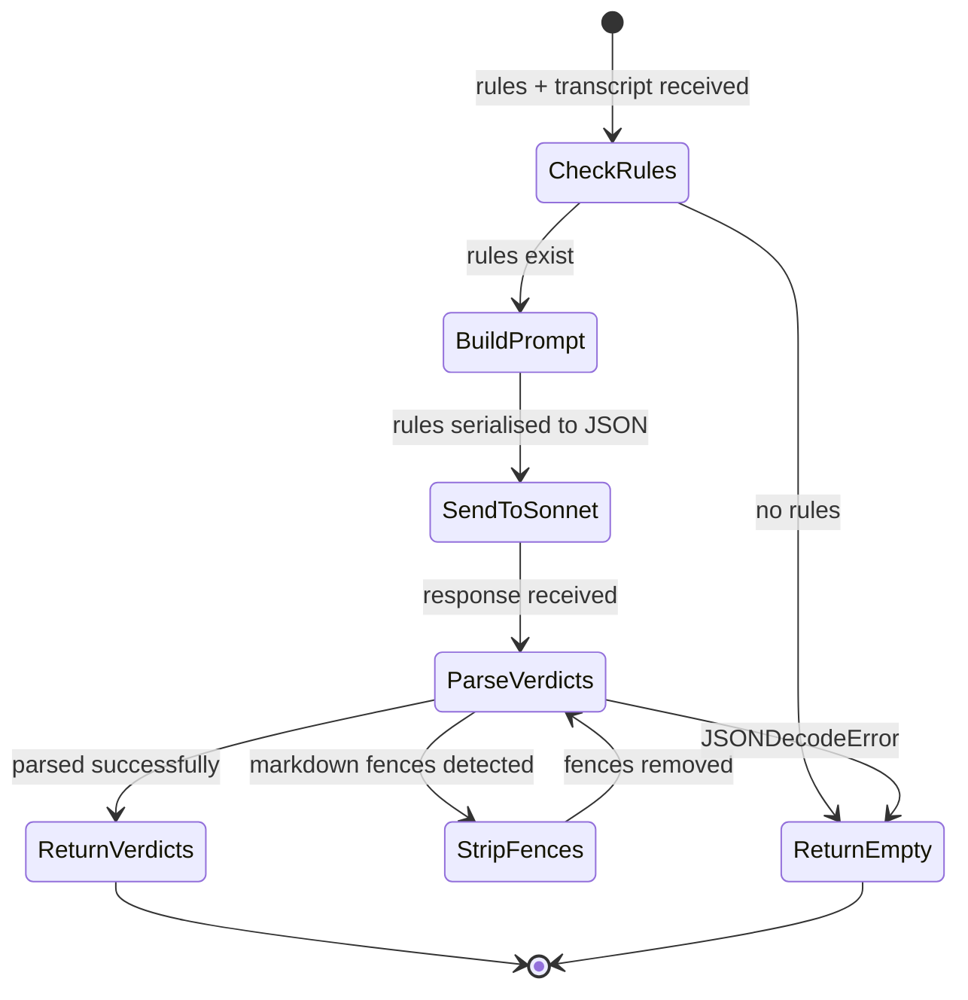

# Compliance Evaluator Agent

An AI auditor that evaluates debt collection agent transcripts against compliance rules, producing a **Regulatory Card** with PASS/FAIL verdicts, reasoning, and turn citations for each applicable rule.

---

## Quick Start

```bash
./run.sh
```

Then open **http://localhost:8502**

Credentials:
- `senior` / `senior123` — full access (Admin, Reviewer, Audit Log)
- `junior` / `junior123` — Reviewer only (Tier-1 rules only)

> **Requires:** Docker Desktop running. Run `./run.sh` — it starts the MLX model servers automatically.

---

## Architecture



### Trigger Detection State Diagram



### Corrective RAG State Diagram



### Evaluation State Diagram



---

## Models Used

| Role | Model | Why |
|------|-------|-----|
| Trigger detection | `Qwen3-4B-4bit` (MLX local) | Fast 4B model, JSON instruction following, no API cost |
| Evaluation | `Qwen3.5-9B-MLX-4bit` (MLX local) | Strong reasoning, fully local, Apple Silicon optimised |
| Embeddings | `BAAI/bge-base-en-v1.5` (local) | 84.7% recall, 768-dim, ~420MB, English-optimised |

**LLM access:** Both models run locally via `mlx_lm.server` on Apple Silicon. Requests are proxied through a [bifrost](https://github.com/maximhq/bifrost) Docker container (port 8080) which routes `mlx-trigger/*` → port 8081 and `mlx-evaluator/*` → port 8082.

To switch between local MLX and cloud providers, update `config.yaml` and set `USE_STRUCTURED_OUTPUT` in `.env`:

```yaml
# Phase 1 — Cloud (bifrost → AWS Bedrock)
models:
  trigger_model: "bedrock/global.anthropic.claude-haiku-4-5-20251001-v1:0"
  evaluator_model: "bedrock/global.anthropic.claude-sonnet-4-6"
bifrost:
  base_url: "http://localhost:24242/v1"
```

```yaml
# Phase 2 — Local MLX (bifrost → mlx_lm.server)
models:
  trigger_model: "mlx-trigger/mlx-community/Qwen3-4B-4bit"
  evaluator_model: "mlx-evaluator/mlx-community/Qwen3.5-9B-MLX-4bit"
bifrost:
  base_url: "http://localhost:8080/v1"
```

Zero app code changes required — only `config.yaml` and `USE_STRUCTURED_OUTPUT` env var.

---

## Trigger Label Set

The trigger detector maps transcripts to one or more of these 10 regulatory situation labels:

| Label | Applicable Rules |
|-------|-----------------|
| Debt Dispute | FDCPA-809, FDCPA-807 |
| Financial Hardship | CFPB-HARDSHIP-01, FDCPA-806 |
| Bankruptcy Notification | FDCPA-805, BANKRUPTCY-362 |
| Payment Plan Request | CFPB-HARDSHIP-01, FDCPA-808 |
| Cease and Desist Request | FDCPA-805, FDCPA-806 |
| Account Closure Request | FCRA-623 |
| Fraud Claim | FCRA-605, FCRA-623, FDCPA-807 |
| Identity Verification Failure | FCRA-605 |
| Complaint Escalation | CFPB-COMPLAINT-01 |
| Right to Validation Request | FDCPA-809 |

---

## Rule Schema

```python
class Rule(BaseModel):
    id: str                      # "FDCPA-809"
    citation: str                # "15 U.S.C. § 1692g"
    severity: Literal["critical", "high", "medium", "low"]
    agent_must: list[str]        # required behaviours
    agent_must_not: list[str]    # prohibited behaviours
    role_tag: Literal["junior", "senior", "all"]  # role visibility
    trigger_labels: list[str]    # which triggers activate this rule
    text: str                    # full rule text — embedded in Qdrant
```

10 rules are pre-seeded at startup covering FDCPA, CFPB, FCRA, and Bankruptcy statutes. `BANKRUPTCY-362` and `FCRA-623` are `senior`-only rules.

---

## How Corrective RAG Works

For each transcript evaluation, rules are retrieved via **two parallel paths**:

1. **Deterministic path:** The detected trigger labels are looked up in a hardcoded `TRIGGER_RULE_MAP` dictionary → returns a list of rule IDs.

2. **Semantic path:** The full transcript is embedded with `BAAI/bge-base-en-v1.5` (with BGE asymmetric search prefix) and searched against the Qdrant vector store using cosine similarity → returns top-5 rules by semantic relevance.

**Corrective check:** The two sets are compared. If the Jaccard disagreement ratio exceeds 0.5 (i.e., less than 50% overlap relative to the union), a warning is logged and flagged on the Regulatory Card.

**Result:** The **union** of both paths is always used, filtered by the user's role tag. This ensures neither path's rules are silently dropped.

---

## Eval Set Rationale

10 transcripts, one per major trigger type, designed with **known ground truth**:

| ID | Trigger | Key Rule | Expected |
|----|---------|----------|----------|
| t001 | Debt Dispute | FDCPA-809 | FAIL — agent ignores dispute |
| t002 | Debt Dispute | FDCPA-809 | PASS — agent handles correctly |
| t003 | Financial Hardship | CFPB-HARDSHIP-01 | FAIL — agent denies programs |
| t004 | Payment Plan | FDCPA-808, CFPB-HARDSHIP-01 | PASS — agent offers plan + program |
| t005 | Bankruptcy | BANKRUPTCY-362, FDCPA-805 | FAIL — agent continues collecting |
| t006 | Cease and Desist | FDCPA-805, FDCPA-806 | PASS — agent stops immediately |
| t007 | Fraud Claim | FCRA-605 | FAIL — no identity verification |
| t008 | Complaint Escalation | CFPB-COMPLAINT-01 | PASS — escalates properly |
| t009 | Identity Verification | FCRA-605 | PASS — handles correctly |
| t010 | Right to Validation | FDCPA-809 | FAIL — continues without validating |

Transcripts were generated with Claude Sonnet 4.6 via bifrost to accelerate drafting, then manually reviewed to ensure each transcript unambiguously supports its ground truth verdict.

---

## Measured QoS Numbers

> Run `python3.11 eval/run_eval.py` to generate these numbers (requires Qdrant + MLX servers running).

### Phase 1 — Cloud (bifrost → AWS Bedrock)

| Metric | Result | Target | Status |
|--------|--------|--------|--------|
| Accuracy | **8/10 (80%)** | ≥ 8/10 (80%) | ✅ Met |
| p95 latency | **11.17s** | ≤ 5s | ❌ Missed |
| Mean latency | **16.28s** | — | — |

### Phase 2 — Local MLX (Qwen3-4B trigger + Qwen3.5-9B evaluator on Apple Silicon)

| Metric | Result | Target | Status |
|--------|--------|--------|--------|
| Accuracy | **7/10 (70%)** | ≥ 8/10 (80%) | ❌ Missed |
| p95 latency | **56.41s** | ≤ 5s | ❌ Missed |
| Mean latency | **40.93s** | — | — |

**Phase 2 analysis:**

- **Accuracy (70%):** Qwen3.5-9B is more aggressive than Claude Sonnet 4.6 — it over-flags violations on borderline transcripts (t001, t003) and missed one cease & desist violation (t005). Ground truth was calibrated against Sonnet 4.6 outputs.
- **Latency:** Local MLX inference on Apple Silicon is 30–76s per evaluation (cold KV cache on first request). This is a hardware constraint — no network latency but the 9B model generates ~20 tok/s on M-series. A smaller evaluator model (4B) would improve latency at the cost of accuracy.
- **Trade-off:** Phase 2 is fully air-gapped — zero API costs, zero data leaving the device. For production compliance use cases, privacy may outweigh latency.

---

## What I'd Do Differently With More Time

1. **Self-hosted models from day 1** — Use Ollama with `qwen2.5:3b` + `qwen2.5:7b` as the default. I used bifrost (API-backed) for speed during development; the architecture is designed for a zero-code swap.

2. **Streaming UI** — Stream the evaluator's response token-by-token into the Regulatory Card for better UX.

3. **Proper auth** — bcrypt password hashing, session tokens, per-user audit history.

4. **PDF export** — Generate a signed, timestamped PDF Regulatory Card for compliance teams.

5. **More eval transcripts** — 10 is the minimum. A real benchmark would cover edge cases: multiple simultaneous triggers, ambiguous transcripts, multi-turn disputes.

6. **Retrieval tuning** — The `disagreement_threshold` of 0.5 is a reasonable default but should be calibrated against a larger ground-truth set.

7. **Structured citations** — Parse turn numbers from transcripts at ingestion time so citations are always in the format `Turn N` rather than free-text.

---

## Gen AI Tools Used

| Tool | How Used |
|------|----------|
| **OpenCode** (Claude Sonnet 4.6) | Primary coding assistant — architecture planning, implementation, test writing |
| **bifrost + Claude Haiku 4.5** | Phase 1 trigger detection |
| **bifrost + Claude Sonnet 4.6** | Phase 1 evaluation + QoS transcript generation |
| **mlx_lm.server + Qwen3-4B** | Phase 2 trigger detection (fully local, Apple Silicon) |
| **mlx_lm.server + Qwen3.5-9B** | Phase 2 evaluation (fully local, Apple Silicon) |

### How LLM-Generated Code Was Verified

1. **Unit tests** — Every module has a test file with mocked dependencies. Tests were written alongside the code and must pass before committing.
2. **Manual code review** — Each generated file was read and verified for correctness before committing.
3. **QoS eval set** — 10 transcripts with known ground truth provide end-to-end validation of the full pipeline.
4. **Type annotations + Pydantic** — All data models are Pydantic v2 with `Literal` type constraints, catching schema errors at parse time.

---

## Project Structure

```
compliance-agent/
├── docker-compose.yml      # Qdrant + app containers
├── Dockerfile              # Python 3.11 + uv + pre-downloaded BGE model
├── requirements.txt        # Exact pinned versions
├── config.yaml             # Model IDs, URLs, thresholds
├── run.sh                  # One-command start
├── app/
│   ├── main.py             # Streamlit entrypoint
│   ├── auth.py             # Hardcoded users + role helpers
│   ├── llm_client.py       # OpenAI SDK → bifrost wrapper
│   ├── models/schemas.py   # Pydantic schemas
│   ├── ingestion/          # RuleStore + seed rules
│   ├── detection/          # Trigger detector (Haiku 4.5)
│   ├── retrieval/          # Deterministic + semantic + corrective RAG
│   ├── evaluation/         # Evaluator (Sonnet 4.6)
│   ├── audit/              # SQLite audit log
│   └── ui/                 # Streamlit pages
├── eval/
│   ├── transcripts/        # 10 ground-truth transcripts
│   ├── ground_truth.json   # Expected verdicts per transcript
│   └── run_eval.py         # QoS measurement script
└── tests/                  # Unit tests (27 passing, fully mocked)
```
