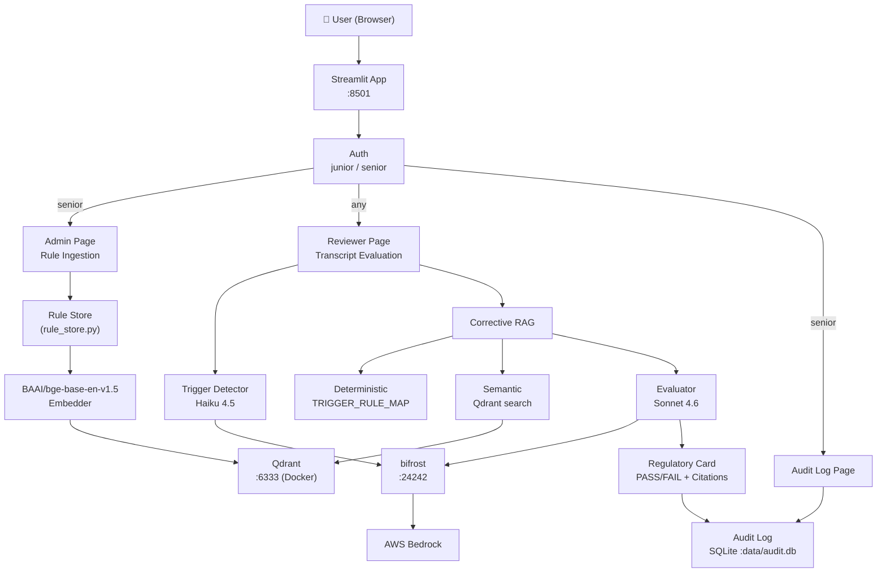
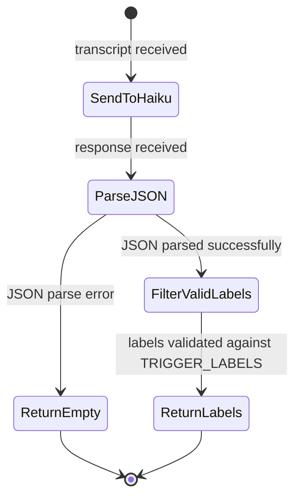
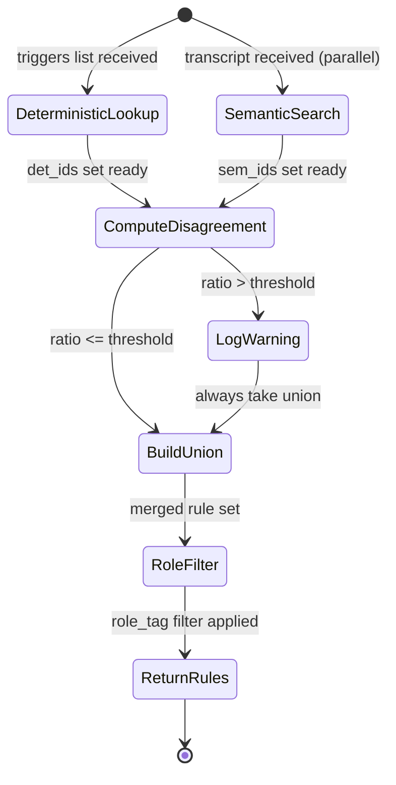
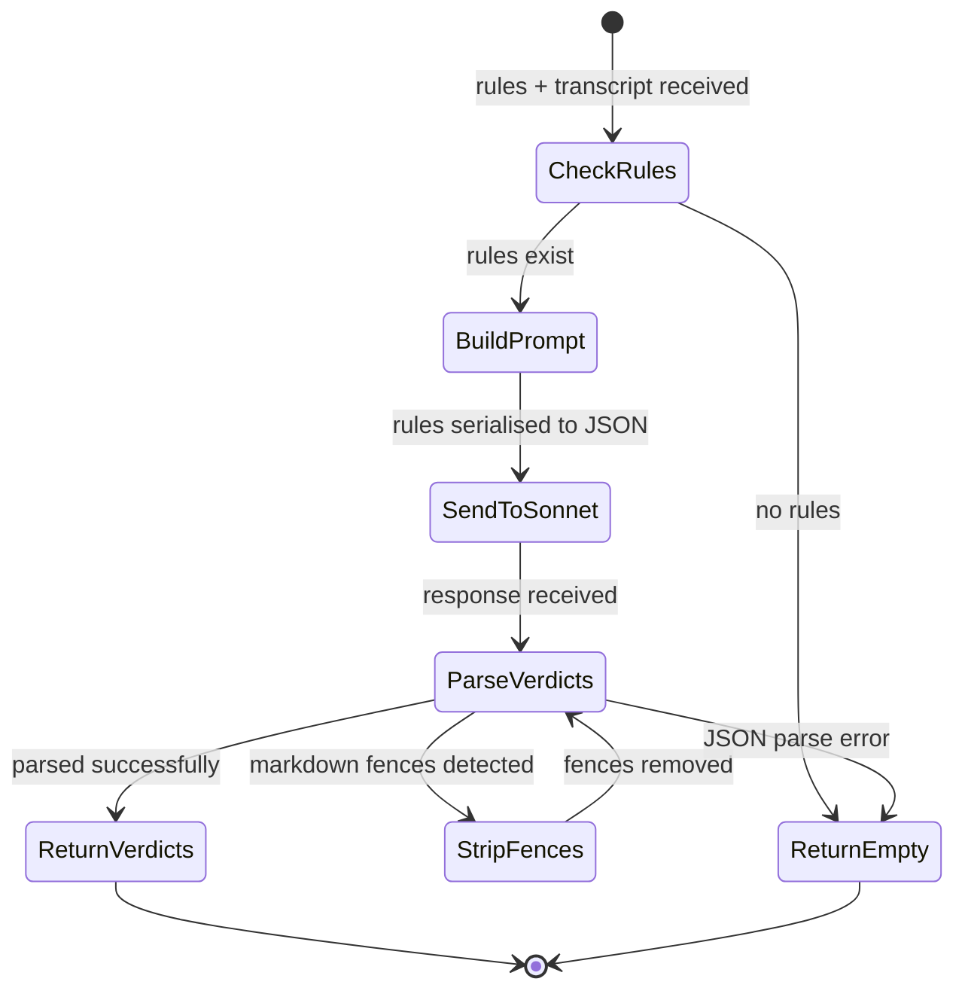

# Compliance Evaluator Agent — Implementation Plan v2

> **For Claude:** REQUIRED SUB-SKILL: Use superpowers:executing-plans to implement this plan task-by-task.

**Goal:** Build an AI auditor that evaluates agent-customer transcripts against compliance rules and produces a Regulatory Card with PASS/FAIL verdicts, reasoning, and turn citations.

**Architecture:** Streamlit frontend (admin rule ingestion + reviewer transcript evaluation) → bifrost-backed LLM calls (OpenAI-compatible, local port 24242) → Qdrant vector store (Docker, separate process) → SQLite append-only audit log. Two-model router: Haiku 4.5 for fast trigger detection, Sonnet 4.6 for deep evaluation. Swap to local MLX/Ollama anytime by changing model IDs in config.yaml.

**Tech Stack:** Python 3.11, Streamlit, openai SDK (pointed at bifrost), Qdrant (Docker), sentence-transformers (`BAAI/bge-base-en-v1.5`, 768-dim, ~420MB), SQLite, Docker Compose, pytest

---

## Model Router

| Role | Model ID | Why |
|------|----------|-----|
| Trigger detector (small) | `bedrock/global.anthropic.claude-haiku-4-5-20251001-v1:0` | Fast, cheap, JSON label extraction |
| Evaluator (large) | `bedrock/global.anthropic.claude-sonnet-4-6` | Deep reasoning, citation quality |
| Base URL | `http://localhost:24242/v1` | Local bifrost, OpenAI-compatible |
| API Key | `"bifrost"` (placeholder, bifrost ignores it) | |

> **Migration path to local models:** Change `trigger_model` and `evaluator_model` in `config.yaml` to any Ollama or MLX-served model ID. Zero code changes required.

---

## Decisions Log

| Decision | Choice | Reason |
|----------|--------|--------|
| Model runtime | bifrost at `localhost:24242` (OpenAI-compatible) | Already running locally; swap to MLX/Ollama by changing config.yaml |
| Trigger model | `bedrock/global.anthropic.claude-haiku-4-5-20251001-v1:0` | Fast, cheap, structured JSON output |
| Evaluator model | `bedrock/global.anthropic.claude-sonnet-4-6` | Deep reasoning, high citation quality |
| Embedding model | `BAAI/bge-base-en-v1.5` (768-dim, ~420MB) | 84.7% hit rate vs 78.1% for MiniLM; best quality/size for English compliance text |
| BGE query prefix | Yes — `"Represent this sentence for searching relevant passages: "` prepended to queries only | Required for asymmetric search with BGE models |
| Vector size | 768 | Matches bge-base-en-v1.5 output dims |
| Vector store | Qdrant in Docker (separate container) | Assignment spec requires separate process |
| Frontend | Streamlit | Fastest to build multi-page app with auth; adequate for demo |
| Deployment | Full Docker Compose (Qdrant + app) | `./run.sh` → `docker compose up --build` |
| bifrost from Docker | `host.docker.internal:24242` + `extra_hosts` for Linux | Mac Docker Desktop; extra_hosts covers Linux |
| Embedding baked into image | Yes — `RUN python -c "SentenceTransformer('BAAI/bge-base-en-v1.5')"` in Dockerfile | No cold-start download at runtime |
| Auth | Two hardcoded users: junior/senior | Spec explicitly allows this |
| Admin page access | Senior only | Only senior role can ingest rules |
| Audit log UI | Third Streamlit page, senior only | Full detail with expandable verdicts |
| Corrective RAG on disagreement | Log warning + take union, no re-query | Meets spec, simpler, faster |
| Transcript format | Free-form, no required structure | More realistic; evaluator extracts context |
| UI error handling | Show Streamlit error banner, keep UI alive | Better UX than traceback crash |
| Test strategy | Unit tests only, fully mocked | 16-hour timebox; integration tests add risk |
| QoS transcripts | Generated by Sonnet 4.6, manually verified | Faster than writing 10 from scratch |
| Architecture diagram | Mermaid diagrams in README (system + state diagrams per process) | Version-controlled, iteratable |
| Streamlit port | 8502 (host) → 8501 (container) | 8501 already in use on host |
| Qdrant persistence | Named Docker volume `qdrant_data` | Rules survive restarts; seed is idempotent |
| Dependency pinning | Exact versions (latest secure as of Apr 2026): streamlit==1.57.0, qdrant-client==1.16.2, sentence-transformers==5.4.1, openai==2.33.0, pydantic==2.13.3 | Reproducible builds |
| Audit log UI | Third page, senior only, full detail with expandable verdicts | Spec requires audit log visibility |
| Error handling in UI | `st.error()` banner + `st.stop()` on failure, keep UI alive | Better UX than traceback crash |
| Transcript format | Free-form, no required structure | More realistic demo; evaluator handles any format |
| QoS transcripts | Generated by Sonnet 4.6 via bifrost, manually verified | Faster than hand-writing 10; honest verification |
| uv in Dockerfile | Yes — `pip install uv` then `uv pip install --system` | ~3x faster image builds |
| Streamlit routing | Single `main.py` with `st.radio()` sidebar | Simpler; no auth leakage across native pages |
| Transcript ID default | Auto-generated UUID (e.g. `t-a3f2c1d4`) | Unique per evaluation without user input |
| Evaluator strictness | Strict — only evaluate rules passed in context | No hallucinated rules; predictable output |
| Zero-rules handling | `st.warning()` with guidance message, no evaluation sent | Better UX than empty card or crash |

---

## Timebox (16 hours)

| Hours | Task |
|-------|------|
| 0–0.5 | Task 1: Scaffold — dirs, Docker Compose, config, run.sh |
| 0.5–1.5 | Task 2: Schemas — Rule, Verdict, RegulatoryCard, AuditEntry |
| 1.5–3 | Task 3: Rule store — Qdrant upsert, semantic search (BGE prefix), seed data |
| 3–4.5 | Task 4: Trigger detector — Haiku 4.5, JSON labels, markdown fence handling |
| 4.5–6 | Task 5: Deterministic retrieval — TRIGGER_RULE_MAP |
| 6–7.5 | Task 6: Corrective RAG — union + disagreement logging (no re-query) |
| 7.5–9.5 | Task 7: Evaluator — Sonnet 4.6, PASS/FAIL, citations, error handling |
| 9.5–10 | Task 8: Audit log — SQLite append-only |
| 10–10.5 | Task 9: Auth — hardcoded users, role filter |
| 10.5–13 | Task 10: Streamlit UI — admin + reviewer + audit log pages, error banners |
| 13–14.5 | Task 11: QoS eval set — generate 10 transcripts with Sonnet 4.6, verify, run_eval.py |
| 14.5–15.5 | Task 12: README + Mermaid diagrams (system + state diagrams) |
| 15.5–16 | Task 13: Final smoke test + push |

---

## Project Structure

```
compliance-agent/
├── docker-compose.yml          # Qdrant only (no Ollama needed)
├── Dockerfile
├── requirements.txt
├── config.yaml                 # model IDs, bifrost URL, Qdrant URL, thresholds
├── run.sh                      # one-command start
├── app/
│   ├── main.py                 # Streamlit entrypoint, login gate
│   ├── auth.py                 # hardcoded users + role helpers
│   ├── llm_client.py           # thin wrapper around openai.OpenAI(base_url=bifrost)
│   ├── models/
│   │   └── schemas.py          # Rule, Verdict, RegulatoryCard, AuditEntry (Pydantic)
│   ├── ingestion/
│   │   ├── rule_store.py       # Qdrant upsert, semantic search, get_by_ids
│   │   └── seed_rules.py       # 10 pre-built FDCPA/CFPB rules, idempotent seed fn
│   ├── detection/
│   │   ├── labels.py           # TRIGGER_LABELS list (10 labels)
│   │   └── trigger_detector.py # Haiku 4.5 → JSON label array
│   ├── retrieval/
│   │   ├── deterministic.py    # TRIGGER_RULE_MAP → rule IDs
│   │   ├── semantic.py         # SemanticRetriever wraps rule_store.semantic_search
│   │   └── corrective.py       # union + disagreement ratio + logging
│   ├── evaluation/
│   │   └── evaluator.py        # Sonnet 4.6 → list[Verdict]
│   ├── audit/
│   │   └── audit_log.py        # SQLite, append-only, read_all
│   └── ui/
│       ├── admin.py            # Rule ingestion form (senior only)
│       └── reviewer.py         # Transcript paste → Regulatory Card display
├── eval/
│   ├── transcripts/            # t001.txt … t010.txt
│   ├── ground_truth.json       # {tid: {triggers, expected_verdicts}}
│   └── run_eval.py             # accuracy + p95 latency measurement
├── tests/
│   ├── conftest.py             # shared fixtures
│   ├── test_schemas.py
│   ├── test_rule_store.py
│   ├── test_trigger_detector.py
│   ├── test_deterministic.py
│   ├── test_corrective.py
│   ├── test_evaluator.py
│   └── test_audit_log.py
└── docs/
    └── plans/
        └── 2026-04-30-compliance-evaluator-v2.md
```

---

## Trigger Label Set

```python
TRIGGER_LABELS = [
    "Debt Dispute",
    "Financial Hardship",
    "Bankruptcy Notification",
    "Payment Plan Request",
    "Cease and Desist Request",
    "Account Closure Request",
    "Fraud Claim",
    "Identity Verification Failure",
    "Complaint Escalation",
    "Right to Validation Request",
]
```

---

## Rule Schema

```python
class Rule(BaseModel):
    id: str                      # "FDCPA-809"
    citation: str                # "15 U.S.C. § 1692g"
    severity: Literal["critical", "high", "medium", "low"]
    agent_must: list[str]        # required behaviours
    agent_must_not: list[str]    # prohibited behaviours
    role_tag: Literal["junior", "senior", "all"]
    trigger_labels: list[str]    # which triggers activate this rule
    text: str                    # full rule text — embedded in Qdrant
```

---

## Seed Rules (10 rules, covers all triggers)

```python
SEED_RULES = [
    Rule(id="FDCPA-809", citation="15 U.S.C. § 1692g", severity="critical",
         agent_must=["provide written validation notice within 5 days of initial contact"],
         agent_must_not=["continue collection activity after receiving written dispute without validation"],
         role_tag="all", trigger_labels=["Debt Dispute", "Right to Validation Request"],
         text="Upon receiving a written dispute, the debt collector must cease collection until it obtains verification of the debt and mails it to the consumer."),

    Rule(id="FDCPA-805", citation="15 U.S.C. § 1692c", severity="high",
         agent_must=["cease communication upon written request"],
         agent_must_not=["contact consumer after cease-and-desist received", "contact consumer at inconvenient times"],
         role_tag="all", trigger_labels=["Cease and Desist Request", "Bankruptcy Notification"],
         text="A debt collector must not communicate with a consumer after receiving written notice to cease communication, except to notify of specific actions."),

    Rule(id="FDCPA-806", citation="15 U.S.C. § 1692d", severity="critical",
         agent_must=["maintain professional tone throughout conversation"],
         agent_must_not=["harass, oppress, or abuse consumer", "use obscene language", "make repeated calls to annoy"],
         role_tag="all", trigger_labels=["Financial Hardship", "Cease and Desist Request"],
         text="A debt collector may not engage in any conduct the natural consequence of which is to harass, oppress, or abuse any person."),

    Rule(id="FDCPA-807", citation="15 U.S.C. § 1692e", severity="critical",
         agent_must=["accurately represent debt amount and status"],
         agent_must_not=["make false representations", "misrepresent debt amount", "threaten legal action not intended"],
         role_tag="all", trigger_labels=["Debt Dispute", "Fraud Claim"],
         text="A debt collector may not use any false, deceptive, or misleading representation in connection with the collection of any debt."),

    Rule(id="FDCPA-808", citation="15 U.S.C. § 1692f", severity="high",
         agent_must=["only collect amounts expressly authorized by agreement or permitted by law"],
         agent_must_not=["collect unauthorized fees or interest", "accept payment by means that incur additional fees without disclosure"],
         role_tag="all", trigger_labels=["Payment Plan Request"],
         text="A debt collector may not use unfair or unconscionable means to collect a debt, including collecting unauthorized amounts."),

    Rule(id="CFPB-HARDSHIP-01", citation="CFPB Bulletin 2013-07", severity="high",
         agent_must=["offer information about hardship programs when consumer indicates financial difficulty",
                     "document hardship claim in account notes"],
         agent_must_not=["deny existence of hardship programs", "pressure consumer in financial distress"],
         role_tag="all", trigger_labels=["Financial Hardship", "Payment Plan Request"],
         text="Servicers must have policies to identify consumers experiencing financial hardship and must provide information about available assistance programs."),

    Rule(id="BANKRUPTCY-362", citation="11 U.S.C. § 362", severity="critical",
         agent_must=["immediately cease all collection activity upon notification of bankruptcy filing",
                     "note bankruptcy notification in account"],
         agent_must_not=["continue collection after bankruptcy notification", "demand payment after bankruptcy notice"],
         role_tag="senior", trigger_labels=["Bankruptcy Notification"],
         text="The automatic stay prohibits any act to collect a pre-petition debt. Upon notification of bankruptcy, all collection must immediately cease."),

    Rule(id="FCRA-605", citation="15 U.S.C. § 1681c", severity="high",
         agent_must=["verify consumer identity before discussing account details"],
         agent_must_not=["discuss account details with unverified caller", "bypass identity verification"],
         role_tag="all", trigger_labels=["Identity Verification Failure", "Fraud Claim"],
         text="Consumer reporting agencies and furnishers must maintain reasonable procedures to verify consumer identity before disclosing account information."),

    Rule(id="FCRA-623", citation="15 U.S.C. § 1681s-2", severity="high",
         agent_must=["investigate disputed information within 30 days",
                     "correct or delete inaccurate information after investigation"],
         agent_must_not=["furnish information known to be inaccurate", "ignore consumer dispute"],
         role_tag="senior", trigger_labels=["Account Closure Request", "Fraud Claim"],
         text="Furnishers of information must investigate disputes from consumers and correct or delete inaccurate, incomplete, or unverifiable information."),

    Rule(id="CFPB-COMPLAINT-01", citation="CFPB Regulation 12 CFR 1024", severity="medium",
         agent_must=["acknowledge complaint and provide reference number",
                     "escalate to supervisor when requested",
                     "document complaint details in account notes"],
         agent_must_not=["dismiss or minimize consumer complaint", "refuse escalation request"],
         role_tag="all", trigger_labels=["Complaint Escalation"],
         text="Servicers must maintain accessible complaint processes, acknowledge complaints promptly, and escalate unresolved issues through proper channels."),
]
```

---

## Deterministic Trigger → Rule ID Map

```python
TRIGGER_RULE_MAP = {
    "Debt Dispute":                  ["FDCPA-809", "FDCPA-807"],
    "Financial Hardship":            ["CFPB-HARDSHIP-01", "FDCPA-806"],
    "Bankruptcy Notification":       ["FDCPA-805", "BANKRUPTCY-362"],
    "Payment Plan Request":          ["CFPB-HARDSHIP-01", "FDCPA-808"],
    "Cease and Desist Request":      ["FDCPA-805", "FDCPA-806"],
    "Account Closure Request":       ["FCRA-623"],
    "Fraud Claim":                   ["FCRA-605", "FCRA-623", "FDCPA-807"],
    "Identity Verification Failure": ["FCRA-605"],
    "Complaint Escalation":          ["CFPB-COMPLAINT-01"],
    "Right to Validation Request":   ["FDCPA-809"],
}
```

---

## Auth

```python
USERS = {
    "junior": {"password": "junior123", "role": "junior"},
    "senior": {"password": "senior123", "role": "senior"},
}
# junior → sees rules with role_tag in ("junior", "all")
# senior → sees all rules (role_tag in ("junior", "senior", "all"))
# Only senior can access Admin page
```

---

## Task 1: Scaffold

**Files to create:**
- `docker-compose.yml`
- `Dockerfile`
- `requirements.txt`
- `config.yaml`
- `run.sh`
- `app/__init__.py` (empty)
- `app/models/__init__.py` (empty)
- `app/ingestion/__init__.py` (empty)
- `app/detection/__init__.py` (empty)
- `app/retrieval/__init__.py` (empty)
- `app/evaluation/__init__.py` (empty)
- `app/audit/__init__.py` (empty)
- `app/ui/__init__.py` (empty)
- `tests/__init__.py` (empty)
- `tests/conftest.py`

**`docker-compose.yml`:**
```yaml
version: "3.9"
services:
  qdrant:
    image: qdrant/qdrant:latest
    ports:
      - "6333:6333"
      - "6334:6334"
    volumes:
      - qdrant_data:/qdrant/storage
    healthcheck:
      test: ["CMD", "curl", "-f", "http://localhost:6333/readyz"]
      interval: 5s
      timeout: 3s
      retries: 10

  app:
    build: .
    ports:
      - "8502:8501"
    depends_on:
      qdrant:
        condition: service_healthy
    environment:
      - QDRANT_URL=http://qdrant:6333
      - BIFROST_URL=http://host.docker.internal:24242/v1
    volumes:
      - ./app:/app/app
      - ./eval:/app/eval
      - ./config.yaml:/app/config.yaml
      - audit_data:/app/data
    extra_hosts:
      - "host.docker.internal:host-gateway"

volumes:
  qdrant_data:
  audit_data:
```

**`Dockerfile`:**
```dockerfile
FROM python:3.11-slim
WORKDIR /app
COPY requirements.txt .
# uv for ~3x faster installs
RUN pip install uv && uv pip install --system -r requirements.txt
# Pre-download BGE embedding model at build time (~420MB, avoids cold-start)
RUN python -c "from sentence_transformers import SentenceTransformer; SentenceTransformer('BAAI/bge-base-en-v1.5')"
COPY . .
RUN mkdir -p data
EXPOSE 8501
CMD ["streamlit", "run", "app/main.py", "--server.port=8501", "--server.address=0.0.0.0"]
```
streamlit==1.57.0
qdrant-client==1.16.2
sentence-transformers==5.4.1
openai==2.33.0
pydantic==2.13.3
pyyaml==6.0.2
pytest==8.3.5
pytest-mock==3.15.1
```

**`config.yaml`:**
```yaml
models:
  trigger_model: "bedrock/global.anthropic.claude-haiku-4-5-20251001-v1:0"
  evaluator_model: "bedrock/global.anthropic.claude-sonnet-4-6"
  # To switch to local: set these to your Ollama/MLX model ID
  # and set bifrost_url to http://localhost:11434/v1

bifrost:
  base_url: "http://localhost:24242/v1"
  api_key: "bifrost"

qdrant:
  url: "http://localhost:6333"
  collection: "compliance_rules"
  vector_size: 768   # BAAI/bge-base-en-v1.5

retrieval:
  semantic_top_k: 5
  disagreement_threshold: 0.5

audit:
  db_path: "data/audit.db"
```

**`run.sh`:**
```bash
#!/bin/bash
set -e
echo "=== Compliance Evaluator ==="
echo "Starting services..."
docker compose up --build -d
echo ""
echo "Waiting for Qdrant..."
until curl -sf http://localhost:6333/readyz > /dev/null 2>&1; do
  printf "."; sleep 1
done
echo " ready."
echo ""
echo "App running at: http://localhost:8502"
echo "Credentials: senior/senior123 or junior/junior123"
docker compose logs -f app
```

**`tests/conftest.py`:**
```python
import pytest
from unittest.mock import MagicMock

@pytest.fixture
def mock_qdrant_client(mocker):
    return mocker.patch("qdrant_client.QdrantClient")

@pytest.fixture
def mock_openai_client(mocker):
    return mocker.patch("openai.OpenAI")
```

**Step: make run.sh executable, create all `__init__.py` files, commit**
```bash
chmod +x run.sh
find app tests -type d | xargs -I{} touch {}/__init__.py
git add .
git commit -m "feat: project scaffold, Docker Compose (Qdrant only), config"
```

---

## Task 2: Schemas

**File:** `app/models/schemas.py`
**Test:** `tests/test_schemas.py`

**`app/models/schemas.py`:**
```python
from __future__ import annotations
from pydantic import BaseModel, field_validator
from typing import Literal


class Rule(BaseModel):
    id: str
    citation: str
    severity: Literal["critical", "high", "medium", "low"]
    agent_must: list[str]
    agent_must_not: list[str]
    role_tag: Literal["junior", "senior", "all"]
    trigger_labels: list[str]
    text: str


class Verdict(BaseModel):
    rule_id: str
    verdict: Literal["PASS", "FAIL"]
    reasoning: str
    citation: str        # e.g. "Turn 3", "Turns 2-4"
    severity: str


class RegulatoryCard(BaseModel):
    transcript_id: str
    verdicts: list[Verdict]
    evaluated_at: str
    model_used: str = ""
    latency_seconds: float = 0.0
    corrective_disagreement: bool = False

    @property
    def pass_count(self) -> int:
        return sum(1 for v in self.verdicts if v.verdict == "PASS")

    @property
    def fail_count(self) -> int:
        return sum(1 for v in self.verdicts if v.verdict == "FAIL")


class AuditEntry(BaseModel):
    transcript_id: str
    rules_evaluated: list[str]
    verdicts: list[Verdict]
    model_used: str
    latency_seconds: float
    timestamp: str
    user_role: str
    corrective_disagreement: bool = False
```

**`tests/test_schemas.py`:**
```python
from app.models.schemas import Rule, Verdict, RegulatoryCard, AuditEntry

def test_rule_creation():
    r = Rule(id="FDCPA-809", citation="15 U.S.C. § 1692g", severity="critical",
             agent_must=["send notice"], agent_must_not=["ignore dispute"],
             role_tag="all", trigger_labels=["Debt Dispute"], text="Must send notice.")
    assert r.id == "FDCPA-809"
    assert r.severity == "critical"

def test_verdict():
    v = Verdict(rule_id="FDCPA-809", verdict="PASS",
                reasoning="Agent complied.", citation="Turn 3", severity="critical")
    assert v.verdict == "PASS"

def test_regulatory_card_counts():
    verdicts = [
        Verdict(rule_id="A", verdict="PASS", reasoning="ok", citation="T1", severity="high"),
        Verdict(rule_id="B", verdict="FAIL", reasoning="missed", citation="T2", severity="critical"),
    ]
    card = RegulatoryCard(transcript_id="t001", verdicts=verdicts,
                          evaluated_at="2026-04-30T10:00:00")
    assert card.pass_count == 1
    assert card.fail_count == 1

def test_audit_entry():
    v = Verdict(rule_id="FDCPA-809", verdict="PASS",
                reasoning="ok", citation="T1", severity="critical")
    e = AuditEntry(transcript_id="t001", rules_evaluated=["FDCPA-809"],
                   verdicts=[v], model_used="sonnet-4-6",
                   latency_seconds=1.5, timestamp="2026-04-30T10:00:00",
                   user_role="senior")
    assert e.transcript_id == "t001"
```

**Run:** `pytest tests/test_schemas.py -v` → expect PASS

**Commit:**
```bash
git add app/models/schemas.py tests/test_schemas.py
git commit -m "feat: Pydantic schemas (Rule, Verdict, RegulatoryCard, AuditEntry)"
```

---

## Task 3: LLM Client Wrapper

**File:** `app/llm_client.py`

```python
from __future__ import annotations
import yaml
import os
from openai import OpenAI


def _load_config() -> dict:
    config_path = os.environ.get("CONFIG_PATH", "config.yaml")
    with open(config_path) as f:
        return yaml.safe_load(f)


def get_client() -> OpenAI:
    cfg = _load_config()
    base_url = os.environ.get("BIFROST_URL", cfg["bifrost"]["base_url"])
    api_key = cfg["bifrost"].get("api_key", "bifrost")
    return OpenAI(base_url=base_url, api_key=api_key)


def get_models() -> dict[str, str]:
    cfg = _load_config()
    return {
        "trigger": cfg["models"]["trigger_model"],
        "evaluator": cfg["models"]["evaluator_model"],
    }
```

**Commit:**
```bash
git add app/llm_client.py
git commit -m "feat: LLM client wrapper pointing at local bifrost"
```

---

## Task 4: Rule Store + Seed Rules

**Files:**
- `app/ingestion/rule_store.py`
- `app/ingestion/seed_rules.py`
**Test:** `tests/test_rule_store.py`

**`app/ingestion/rule_store.py`:**
```python
from __future__ import annotations
import uuid
import os
import yaml
from qdrant_client import QdrantClient
from qdrant_client.models import (
    VectorParams, Distance, PointStruct,
    Filter, FieldCondition, MatchAny
)
from sentence_transformers import SentenceTransformer
from app.models.schemas import Rule

COLLECTION = "compliance_rules"
VECTOR_SIZE = 768   # BAAI/bge-base-en-v1.5
_EMBEDDER: SentenceTransformer | None = None


def _get_embedder() -> SentenceTransformer:
    global _EMBEDDER
    if _EMBEDDER is None:
        _EMBEDDER = SentenceTransformer("BAAI/bge-base-en-v1.5")
    return _EMBEDDER


def _rule_id_to_uuid(rule_id: str) -> str:
    return str(uuid.uuid5(uuid.NAMESPACE_DNS, rule_id))


class RuleStore:
    def __init__(self, qdrant_url: str | None = None):
        if qdrant_url is None:
            cfg_path = os.environ.get("CONFIG_PATH", "config.yaml")
            with open(cfg_path) as f:
                cfg = yaml.safe_load(f)
            qdrant_url = os.environ.get("QDRANT_URL", cfg["qdrant"]["url"])
        self.client = QdrantClient(url=qdrant_url, timeout=10)
        self._ensure_collection()

    def _ensure_collection(self):
        existing = [c.name for c in self.client.get_collections().collections]
        if COLLECTION not in existing:
            self.client.create_collection(
                collection_name=COLLECTION,
                vectors_config=VectorParams(size=VECTOR_SIZE, distance=Distance.COSINE),
            )

    def add_rule(self, rule: Rule) -> None:
        vector = _get_embedder().encode(rule.text).tolist()
        point = PointStruct(
            id=_rule_id_to_uuid(rule.id),
            vector=vector,
            payload=rule.model_dump(),
        )
        self.client.upsert(collection_name=COLLECTION, points=[point])

    def rule_exists(self, rule_id: str) -> bool:
        results = self.client.retrieve(
            collection_name=COLLECTION,
            ids=[_rule_id_to_uuid(rule_id)],
        )
        return len(results) > 0

    def semantic_search(self, query: str, top_k: int = 5, role: str = "senior") -> list[Rule]:
        role_tags = ["all"] if role == "junior" else ["junior", "senior", "all"]
        # BGE asymmetric search requires query prefix for best recall
        prefixed_query = f"Represent this sentence for searching relevant passages: {query}"
        vector = _get_embedder().encode(prefixed_query).tolist()
        results = self.client.search(
            collection_name=COLLECTION,
            query_vector=vector,
            limit=top_k,
            query_filter=Filter(
                must=[FieldCondition(key="role_tag", match=MatchAny(any=role_tags))]
            ),
        )
        return [Rule(**r.payload) for r in results]

    def get_by_ids(self, rule_ids: list[str], role: str = "senior") -> list[Rule]:
        if not rule_ids:
            return []
        role_tags = ["all"] if role == "junior" else ["junior", "senior", "all"]
        points = self.client.retrieve(
            collection_name=COLLECTION,
            ids=[_rule_id_to_uuid(rid) for rid in rule_ids],
            with_payload=True,
        )
        return [Rule(**p.payload) for p in points if p.payload.get("role_tag") in role_tags]

    def count(self) -> int:
        return self.client.count(collection_name=COLLECTION).count
```

**`app/ingestion/seed_rules.py`:**
```python
from app.models.schemas import Rule
from app.ingestion.rule_store import RuleStore

SEED_RULES: list[Rule] = [
    Rule(id="FDCPA-809", citation="15 U.S.C. § 1692g", severity="critical",
         agent_must=["provide written validation notice within 5 days of initial contact"],
         agent_must_not=["continue collection after written dispute without sending validation"],
         role_tag="all", trigger_labels=["Debt Dispute", "Right to Validation Request"],
         text="Upon receiving a written dispute, the debt collector must cease collection until it obtains verification of the debt and mails it to the consumer. A validation notice must be sent within 5 days of initial contact."),

    Rule(id="FDCPA-805", citation="15 U.S.C. § 1692c", severity="high",
         agent_must=["cease communication upon written request"],
         agent_must_not=["contact consumer after cease-and-desist received",
                         "contact consumer at inconvenient times (before 8am or after 9pm)"],
         role_tag="all", trigger_labels=["Cease and Desist Request", "Bankruptcy Notification"],
         text="A debt collector must not communicate with a consumer after receiving written notice to cease communication, except to notify of specific legal actions."),

    Rule(id="FDCPA-806", citation="15 U.S.C. § 1692d", severity="critical",
         agent_must=["maintain professional and respectful tone throughout conversation"],
         agent_must_not=["harass, oppress, or abuse the consumer",
                         "use obscene or profane language",
                         "make repeated phone calls to annoy"],
         role_tag="all", trigger_labels=["Financial Hardship", "Cease and Desist Request"],
         text="A debt collector may not engage in any conduct the natural consequence of which is to harass, oppress, or abuse any person in connection with the collection of a debt."),

    Rule(id="FDCPA-807", citation="15 U.S.C. § 1692e", severity="critical",
         agent_must=["accurately state the debt amount, creditor name, and collection status"],
         agent_must_not=["make false or misleading representations",
                         "misrepresent the debt amount or character",
                         "threaten legal action not actually intended or authorized"],
         role_tag="all", trigger_labels=["Debt Dispute", "Fraud Claim"],
         text="A debt collector may not use any false, deceptive, or misleading representation or means in connection with the collection of any debt."),

    Rule(id="FDCPA-808", citation="15 U.S.C. § 1692f", severity="high",
         agent_must=["only collect amounts expressly authorized by the agreement or permitted by law"],
         agent_must_not=["collect unauthorized fees, interest, or charges",
                         "accept postdated checks by more than 5 days without notice"],
         role_tag="all", trigger_labels=["Payment Plan Request"],
         text="A debt collector may not use unfair or unconscionable means to collect a debt, including collecting amounts not expressly authorized by the agreement or permitted by law."),

    Rule(id="CFPB-HARDSHIP-01", citation="CFPB Bulletin 2013-07", severity="high",
         agent_must=["inform consumer about available hardship or assistance programs",
                     "document hardship claim in account notes"],
         agent_must_not=["deny existence of hardship or payment assistance programs",
                         "apply pressure tactics to consumer experiencing financial distress"],
         role_tag="all", trigger_labels=["Financial Hardship", "Payment Plan Request"],
         text="Servicers must have reasonable policies and procedures to identify consumers experiencing financial difficulty and must provide meaningful information about available assistance and hardship programs."),

    Rule(id="BANKRUPTCY-362", citation="11 U.S.C. § 362 (Automatic Stay)", severity="critical",
         agent_must=["immediately cease all collection activity upon bankruptcy notification",
                     "note bankruptcy filing in account and escalate to compliance team"],
         agent_must_not=["continue collection calls or letters after bankruptcy notice",
                         "demand or accept payment on pre-petition debt after bankruptcy notice"],
         role_tag="senior", trigger_labels=["Bankruptcy Notification"],
         text="The automatic stay under 11 U.S.C. § 362 prohibits any act to collect or recover a pre-petition debt. Upon notification of bankruptcy, all collection activity must immediately and completely cease."),

    Rule(id="FCRA-605", citation="15 U.S.C. § 1681c", severity="high",
         agent_must=["verify consumer identity using at least two identification factors before discussing account",
                     "document verification method in call notes"],
         agent_must_not=["discuss account details or balances with an unverified caller",
                         "bypass or skip identity verification steps"],
         role_tag="all", trigger_labels=["Identity Verification Failure", "Fraud Claim"],
         text="Consumer reporting agencies and furnishers must maintain reasonable procedures to verify consumer identity before disclosing or acting on account information."),

    Rule(id="FCRA-623", citation="15 U.S.C. § 1681s-2", severity="high",
         agent_must=["investigate disputed information within 30 days",
                     "correct, delete, or block inaccurate information after investigation",
                     "notify consumer of investigation outcome"],
         agent_must_not=["furnish information known or suspected to be inaccurate",
                         "ignore or dismiss a consumer dispute"],
         role_tag="senior", trigger_labels=["Account Closure Request", "Fraud Claim"],
         text="Furnishers of information to consumer reporting agencies have a duty to investigate consumer disputes and correct or delete inaccurate, incomplete, or unverifiable information."),

    Rule(id="CFPB-COMPLAINT-01", citation="CFPB Regulation 12 CFR 1024.35", severity="medium",
         agent_must=["acknowledge the complaint and provide a reference or case number",
                     "escalate to a supervisor or compliance team when consumer requests it",
                     "document all complaint details in the account notes"],
         agent_must_not=["dismiss or minimize the consumer's complaint",
                         "refuse a reasonable escalation request",
                         "fail to document the complaint"],
         role_tag="all", trigger_labels=["Complaint Escalation"],
         text="Servicers must maintain accessible and effective complaint processes, acknowledge complaints promptly with a reference number, and escalate unresolved issues through proper compliance channels."),
]


def seed(store: RuleStore, force: bool = False) -> int:
    """Idempotently seed rules. Returns number of rules inserted."""
    inserted = 0
    for rule in SEED_RULES:
        if force or not store.rule_exists(rule.id):
            store.add_rule(rule)
            inserted += 1
    return inserted
```

**`tests/test_rule_store.py`:**
```python
import pytest
from unittest.mock import MagicMock, patch
from app.models.schemas import Rule
from app.ingestion.rule_store import RuleStore, _rule_id_to_uuid

SAMPLE_RULE = Rule(
    id="FDCPA-809", citation="15 U.S.C. § 1692g", severity="critical",
    agent_must=["send notice"], agent_must_not=["ignore dispute"],
    role_tag="all", trigger_labels=["Debt Dispute"],
    text="Must send validation notice within 5 days."
)


@pytest.fixture
def store(mocker):
    mocker.patch("app.ingestion.rule_store.QdrantClient")
    mocker.patch("app.ingestion.rule_store._get_embedder")
    mocker.patch("builtins.open", mocker.mock_open(read_data="qdrant:\n  url: http://localhost:6333\n"))
    mocker.patch("yaml.safe_load", return_value={"qdrant": {"url": "http://localhost:6333"}})
    s = RuleStore(qdrant_url="http://localhost:6333")
    s.client = MagicMock()
    s.client.get_collections.return_value = MagicMock(collections=[])
    return s


def test_add_rule_calls_upsert(store, mocker):
    mocker.patch("app.ingestion.rule_store._get_embedder").return_value.encode.return_value = [0.1] * 384
    store.add_rule(SAMPLE_RULE)
    assert store.client.upsert.called


def test_rule_id_to_uuid_deterministic():
    a = _rule_id_to_uuid("FDCPA-809")
    b = _rule_id_to_uuid("FDCPA-809")
    assert a == b


def test_get_by_ids_empty_returns_empty(store):
    result = store.get_by_ids([])
    assert result == []
```

**Run:** `pytest tests/test_rule_store.py -v`

**Commit:**
```bash
git add app/ingestion/ tests/test_rule_store.py
git commit -m "feat: rule store (Qdrant upsert, semantic search, get_by_ids) + seed rules"
```

---

## Task 5: Trigger Detector

**Files:**
- `app/detection/labels.py`
- `app/detection/trigger_detector.py`
**Test:** `tests/test_trigger_detector.py`

**`app/detection/labels.py`:**
```python
TRIGGER_LABELS = [
    "Debt Dispute",
    "Financial Hardship",
    "Bankruptcy Notification",
    "Payment Plan Request",
    "Cease and Desist Request",
    "Account Closure Request",
    "Fraud Claim",
    "Identity Verification Failure",
    "Complaint Escalation",
    "Right to Validation Request",
]
```

**`app/detection/trigger_detector.py`:**
```python
from __future__ import annotations
import json
from app.detection.labels import TRIGGER_LABELS
from app.llm_client import get_client, get_models

SYSTEM_PROMPT = """\
You are a regulatory trigger classifier for debt collection conversations.
Analyze the transcript and return ONLY a JSON array of triggered regulatory situations.
Choose ONLY from this exact list:
{labels}

Rules:
- Return [] if no triggers apply
- Return only labels from the list above — no variations, no new labels
- No explanation, no markdown, no code fences — just the raw JSON array

Example output: ["Debt Dispute", "Right to Validation Request"]
"""


class TriggerDetector:
    def __init__(self):
        self.client = get_client()
        self.model = get_models()["trigger"]

    def detect(self, transcript: str) -> list[str]:
        prompt = SYSTEM_PROMPT.format(labels=json.dumps(TRIGGER_LABELS, indent=2))
        try:
            response = self.client.chat.completions.create(
                model=self.model,
                messages=[
                    {"role": "system", "content": prompt},
                    {"role": "user", "content": f"Transcript:\n{transcript}"},
                ],
                max_tokens=256,
                temperature=0.0,
            )
            content = response.choices[0].message.content.strip()
            # Strip markdown fences if model adds them
            if content.startswith("```"):
                content = content.split("```")[1]
                if content.startswith("json"):
                    content = content[4:]
            labels = json.loads(content)
            return [l for l in labels if l in TRIGGER_LABELS]
        except (json.JSONDecodeError, IndexError, Exception):
            return []
```

**`tests/test_trigger_detector.py`:**
```python
import json
import pytest
from unittest.mock import MagicMock, patch
from app.detection.trigger_detector import TriggerDetector

TRANSCRIPT = (
    "Agent: I see you're disputing this debt.\n"
    "Customer: Yes, I don't believe I owe this.\n"
    "Agent: I understand, we'll need to validate."
)


@pytest.fixture
def detector(mocker):
    mocker.patch("app.detection.trigger_detector.get_client")
    mocker.patch("app.detection.trigger_detector.get_models",
                 return_value={"trigger": "test-model", "evaluator": "test-model"})
    d = TriggerDetector()
    d.client = MagicMock()
    return d


def _mock_response(content: str):
    msg = MagicMock()
    msg.content = content
    choice = MagicMock()
    choice.message = msg
    resp = MagicMock()
    resp.choices = [choice]
    return resp


def test_detects_valid_labels(detector):
    detector.client.chat.completions.create.return_value = _mock_response(
        '["Debt Dispute", "Right to Validation Request"]'
    )
    labels = detector.detect(TRANSCRIPT)
    assert "Debt Dispute" in labels
    assert "Right to Validation Request" in labels


def test_filters_invalid_labels(detector):
    detector.client.chat.completions.create.return_value = _mock_response(
        '["Debt Dispute", "Made Up Label"]'
    )
    labels = detector.detect(TRANSCRIPT)
    assert "Made Up Label" not in labels
    assert "Debt Dispute" in labels


def test_bad_json_returns_empty(detector):
    detector.client.chat.completions.create.return_value = _mock_response(
        "I cannot determine triggers from this transcript."
    )
    labels = detector.detect(TRANSCRIPT)
    assert labels == []


def test_markdown_fenced_json_parsed(detector):
    detector.client.chat.completions.create.return_value = _mock_response(
        '```json\n["Debt Dispute"]\n```'
    )
    labels = detector.detect(TRANSCRIPT)
    assert "Debt Dispute" in labels
```

**Run:** `pytest tests/test_trigger_detector.py -v`

**Commit:**
```bash
git add app/detection/ tests/test_trigger_detector.py
git commit -m "feat: trigger detector (Haiku 4.5) with JSON label extraction + markdown fence handling"
```

---

## Task 6: Retrieval — Deterministic + Semantic + Corrective RAG

**Files:**
- `app/retrieval/deterministic.py`
- `app/retrieval/semantic.py`
- `app/retrieval/corrective.py`
**Tests:** `tests/test_deterministic.py`, `tests/test_corrective.py`

**`app/retrieval/deterministic.py`:**
```python
TRIGGER_RULE_MAP: dict[str, list[str]] = {
    "Debt Dispute":                  ["FDCPA-809", "FDCPA-807"],
    "Financial Hardship":            ["CFPB-HARDSHIP-01", "FDCPA-806"],
    "Bankruptcy Notification":       ["FDCPA-805", "BANKRUPTCY-362"],
    "Payment Plan Request":          ["CFPB-HARDSHIP-01", "FDCPA-808"],
    "Cease and Desist Request":      ["FDCPA-805", "FDCPA-806"],
    "Account Closure Request":       ["FCRA-623"],
    "Fraud Claim":                   ["FCRA-605", "FCRA-623", "FDCPA-807"],
    "Identity Verification Failure": ["FCRA-605"],
    "Complaint Escalation":          ["CFPB-COMPLAINT-01"],
    "Right to Validation Request":   ["FDCPA-809"],
}


class DeterministicRetriever:
    def get_rule_ids(self, triggers: list[str]) -> list[str]:
        ids: set[str] = set()
        for trigger in triggers:
            ids.update(TRIGGER_RULE_MAP.get(trigger, []))
        return list(ids)
```

**`app/retrieval/semantic.py`:**
```python
from app.ingestion.rule_store import RuleStore
from app.models.schemas import Rule


class SemanticRetriever:
    def __init__(self, rule_store: RuleStore, top_k: int = 5):
        self.store = rule_store
        self.top_k = top_k

    def search(self, query: str, role: str = "senior") -> list[Rule]:
        return self.store.semantic_search(query, top_k=self.top_k, role=role)
```

**`app/retrieval/corrective.py`:**
```python
from __future__ import annotations
import logging
from app.models.schemas import Rule
from app.retrieval.deterministic import DeterministicRetriever
from app.retrieval.semantic import SemanticRetriever
from app.ingestion.rule_store import RuleStore

logger = logging.getLogger(__name__)


class CorrectiveRetriever:
    def __init__(
        self,
        rule_store: RuleStore,
        threshold: float = 0.5,
        top_k: int = 5,
    ):
        self.det = DeterministicRetriever()
        self.sem = SemanticRetriever(rule_store=rule_store, top_k=top_k)
        self.store = rule_store
        self.threshold = threshold

    def retrieve(
        self, triggers: list[str], transcript: str, role: str = "senior"
    ) -> tuple[list[Rule], bool]:
        """
        Returns (rules, disagreed).
        - rules: union of deterministic + semantic results, role-filtered
        - disagreed: True if paths differ by more than threshold
        """
        det_ids = set(self.det.get_rule_ids(triggers))
        sem_rules = self.sem.search(transcript, role=role)
        sem_ids = {r.id for r in sem_rules}

        union_ids = det_ids | sem_ids
        overlap = det_ids & sem_ids
        disagreement_ratio = 1.0 - (len(overlap) / max(len(union_ids), 1))
        disagreed = disagreement_ratio > self.threshold

        if disagreed:
            logger.warning(
                "Corrective RAG disagreement | det=%s | sem=%s | overlap=%s | ratio=%.2f",
                sorted(det_ids), sorted(sem_ids), sorted(overlap), disagreement_ratio
            )

        det_rules = self.store.get_by_ids(list(det_ids), role=role)
        all_rules: dict[str, Rule] = {r.id: r for r in det_rules}
        for r in sem_rules:
            all_rules.setdefault(r.id, r)

        return list(all_rules.values()), disagreed
```

**`tests/test_deterministic.py`:**
```python
from app.retrieval.deterministic import DeterministicRetriever

def test_known_trigger():
    r = DeterministicRetriever()
    assert "FDCPA-809" in r.get_rule_ids(["Debt Dispute"])

def test_unknown_trigger():
    r = DeterministicRetriever()
    assert r.get_rule_ids(["Unknown"]) == []

def test_multiple_triggers_union():
    r = DeterministicRetriever()
    ids = r.get_rule_ids(["Debt Dispute", "Bankruptcy Notification"])
    assert "FDCPA-809" in ids
    assert "BANKRUPTCY-362" in ids

def test_no_duplicates():
    r = DeterministicRetriever()
    # FDCPA-805 appears in both Bankruptcy + Cease and Desist
    ids = r.get_rule_ids(["Bankruptcy Notification", "Cease and Desist Request"])
    assert ids.count("FDCPA-805") == 1
```

**`tests/test_corrective.py`:**
```python
import pytest
from unittest.mock import MagicMock
from app.retrieval.corrective import CorrectiveRetriever
from app.models.schemas import Rule


def make_rule(rule_id: str, role_tag: str = "all") -> Rule:
    return Rule(id=rule_id, citation="x", severity="high",
                agent_must=[], agent_must_not=[],
                role_tag=role_tag, trigger_labels=[], text="x")


@pytest.fixture
def store():
    return MagicMock()


def test_no_disagreement_when_sets_match(store):
    store.semantic_search.return_value = [make_rule("A"), make_rule("B")]
    store.get_by_ids.return_value = [make_rule("A"), make_rule("B")]
    cr = CorrectiveRetriever(rule_store=store)
    # Override det retriever inline
    cr.det.get_rule_ids = lambda triggers: ["A", "B"]
    rules, disagreed = cr.retrieve(["Debt Dispute"], "text", "senior")
    assert not disagreed


def test_disagreement_flagged_when_sets_differ(store):
    store.semantic_search.return_value = [make_rule("C"), make_rule("D")]
    store.get_by_ids.return_value = [make_rule("A"), make_rule("B")]
    cr = CorrectiveRetriever(rule_store=store)
    cr.det.get_rule_ids = lambda triggers: ["A", "B"]
    rules, disagreed = cr.retrieve(["Debt Dispute"], "text", "senior")
    assert disagreed


def test_union_includes_both_paths(store):
    store.semantic_search.return_value = [make_rule("C")]
    store.get_by_ids.return_value = [make_rule("A")]
    cr = CorrectiveRetriever(rule_store=store)
    cr.det.get_rule_ids = lambda triggers: ["A"]
    rules, _ = cr.retrieve(["Debt Dispute"], "text", "senior")
    ids = {r.id for r in rules}
    assert "A" in ids
    assert "C" in ids


def test_empty_triggers_returns_semantic_only(store):
    store.semantic_search.return_value = [make_rule("X")]
    store.get_by_ids.return_value = []
    cr = CorrectiveRetriever(rule_store=store)
    cr.det.get_rule_ids = lambda triggers: []
    rules, _ = cr.retrieve([], "text", "senior")
    assert any(r.id == "X" for r in rules)
```

**Run:** `pytest tests/test_deterministic.py tests/test_corrective.py -v`

**Commit:**
```bash
git add app/retrieval/ tests/test_deterministic.py tests/test_corrective.py
git commit -m "feat: deterministic retriever + semantic retriever + corrective RAG (union + logging)"
```

---

## Task 7: Evaluator (Sonnet 4.6)

**File:** `app/evaluation/evaluator.py`
**Test:** `tests/test_evaluator.py`

**`app/evaluation/evaluator.py`:**
```python
from __future__ import annotations
import json
from app.models.schemas import Rule, Verdict
from app.llm_client import get_client, get_models

SYSTEM_PROMPT = """\
You are a strict compliance auditor evaluating a debt collection agent's conversation.

For each rule provided, determine if the agent PASSED or FAILED compliance.

Return ONLY a valid JSON array. Each element must have exactly these fields:
- "rule_id": the rule ID string
- "verdict": "PASS" or "FAIL"
- "reasoning": one concise sentence explaining the verdict
- "citation": the specific turn(s) cited as evidence (e.g., "Turn 3", "Turns 2-4", "Turn 5 — Agent said: '...'")
- "severity": the severity from the rule

Do not add commentary. Do not use markdown. Return only the JSON array.

Rules to evaluate:
{rules_json}
"""


class Evaluator:
    def __init__(self):
        self.client = get_client()
        self.model = get_models()["evaluator"]

    def evaluate(self, transcript: str, rules: list[Rule]) -> list[Verdict]:
        if not rules:
            return []

        rules_json = json.dumps(
            [{"id": r.id, "citation": r.citation, "severity": r.severity,
              "agent_must": r.agent_must, "agent_must_not": r.agent_must_not,
              "text": r.text}
             for r in rules],
            indent=2
        )

        try:
            response = self.client.chat.completions.create(
                model=self.model,
                messages=[
                    {"role": "system", "content": SYSTEM_PROMPT.format(rules_json=rules_json)},
                    {"role": "user", "content": f"Transcript:\n{transcript}"},
                ],
                max_tokens=2048,
                temperature=0.0,
            )
            content = response.choices[0].message.content.strip()
            if content.startswith("```"):
                content = content.split("```")[1]
                if content.startswith("json"):
                    content = content[4:]
            raw = json.loads(content)
            return [Verdict(**item) for item in raw]
        except (json.JSONDecodeError, KeyError, Exception):
            return []
```

**`tests/test_evaluator.py`:**
```python
import json
import pytest
from unittest.mock import MagicMock, patch
from app.evaluation.evaluator import Evaluator
from app.models.schemas import Rule, Verdict

RULE = Rule(
    id="FDCPA-809", citation="15 U.S.C. § 1692g", severity="critical",
    agent_must=["send validation notice"],
    agent_must_not=["ignore dispute"],
    role_tag="all", trigger_labels=["Debt Dispute"],
    text="Must send validation notice within 5 days."
)

TRANSCRIPT = (
    "Turn 1 — Agent: I see you're disputing this debt.\n"
    "Turn 2 — Customer: Yes I dispute it.\n"
    "Turn 3 — Agent: We'll look into it."
)


@pytest.fixture
def evaluator(mocker):
    mocker.patch("app.evaluation.evaluator.get_client")
    mocker.patch("app.evaluation.evaluator.get_models",
                 return_value={"trigger": "test", "evaluator": "test"})
    e = Evaluator()
    e.client = MagicMock()
    return e


def _mock_response(content: str):
    msg = MagicMock(); msg.content = content
    choice = MagicMock(); choice.message = msg
    resp = MagicMock(); resp.choices = [choice]
    return resp


def test_returns_verdicts(evaluator):
    payload = json.dumps([{
        "rule_id": "FDCPA-809", "verdict": "FAIL",
        "reasoning": "Agent did not send validation notice.",
        "citation": "Turn 3", "severity": "critical"
    }])
    evaluator.client.chat.completions.create.return_value = _mock_response(payload)
    verdicts = evaluator.evaluate(TRANSCRIPT, [RULE])
    assert len(verdicts) == 1
    assert verdicts[0].verdict == "FAIL"
    assert verdicts[0].rule_id == "FDCPA-809"


def test_empty_rules_returns_empty(evaluator):
    verdicts = evaluator.evaluate(TRANSCRIPT, [])
    assert verdicts == []


def test_bad_json_returns_empty(evaluator):
    evaluator.client.chat.completions.create.return_value = _mock_response(
        "I cannot evaluate this transcript."
    )
    verdicts = evaluator.evaluate(TRANSCRIPT, [RULE])
    assert verdicts == []


def test_markdown_fenced_response(evaluator):
    payload = '```json\n[{"rule_id":"FDCPA-809","verdict":"PASS","reasoning":"ok","citation":"Turn 1","severity":"critical"}]\n```'
    evaluator.client.chat.completions.create.return_value = _mock_response(payload)
    verdicts = evaluator.evaluate(TRANSCRIPT, [RULE])
    assert verdicts[0].verdict == "PASS"
```

**Run:** `pytest tests/test_evaluator.py -v`

**Commit:**
```bash
git add app/evaluation/ tests/test_evaluator.py
git commit -m "feat: evaluator (Sonnet 4.6) returning PASS/FAIL verdicts with turn citations"
```

---

## Task 8: Audit Log

**File:** `app/audit/audit_log.py`
**Test:** `tests/test_audit_log.py`

**`app/audit/audit_log.py`:**
```python
from __future__ import annotations
import sqlite3
import json
import os
from app.models.schemas import AuditEntry


class AuditLog:
    def __init__(self, db_path: str | None = None):
        if db_path is None:
            db_path = os.environ.get("AUDIT_DB_PATH", "data/audit.db")
        os.makedirs(os.path.dirname(db_path), exist_ok=True)
        self.db_path = db_path
        self._init_db()

    def _init_db(self):
        with sqlite3.connect(self.db_path) as conn:
            conn.execute("""
                CREATE TABLE IF NOT EXISTS audit_log (
                    id                     INTEGER PRIMARY KEY AUTOINCREMENT,
                    transcript_id          TEXT NOT NULL,
                    rules_evaluated        TEXT NOT NULL,
                    verdicts               TEXT NOT NULL,
                    model_used             TEXT NOT NULL,
                    latency_seconds        REAL NOT NULL,
                    timestamp              TEXT NOT NULL,
                    user_role              TEXT NOT NULL,
                    corrective_disagreement INTEGER NOT NULL DEFAULT 0
                )
            """)

    def append(self, entry: AuditEntry) -> None:
        with sqlite3.connect(self.db_path) as conn:
            conn.execute(
                """INSERT INTO audit_log
                   (transcript_id, rules_evaluated, verdicts, model_used,
                    latency_seconds, timestamp, user_role, corrective_disagreement)
                   VALUES (?, ?, ?, ?, ?, ?, ?, ?)""",
                (
                    entry.transcript_id,
                    json.dumps(entry.rules_evaluated),
                    json.dumps([v.model_dump() for v in entry.verdicts]),
                    entry.model_used,
                    entry.latency_seconds,
                    entry.timestamp,
                    entry.user_role,
                    int(entry.corrective_disagreement),
                )
            )

    def read_all(self) -> list[dict]:
        with sqlite3.connect(self.db_path) as conn:
            conn.row_factory = sqlite3.Row
            rows = conn.execute(
                "SELECT * FROM audit_log ORDER BY id ASC"
            ).fetchall()
            return [dict(r) for r in rows]

    def count(self) -> int:
        with sqlite3.connect(self.db_path) as conn:
            return conn.execute("SELECT COUNT(*) FROM audit_log").fetchone()[0]
```

**`tests/test_audit_log.py`:**
```python
import os
import tempfile
import pytest
from app.audit.audit_log import AuditLog
from app.models.schemas import AuditEntry, Verdict


def make_entry(tid="t001"):
    return AuditEntry(
        transcript_id=tid,
        rules_evaluated=["FDCPA-809"],
        verdicts=[Verdict(rule_id="FDCPA-809", verdict="PASS",
                          reasoning="ok", citation="Turn 1", severity="critical")],
        model_used="test-model",
        latency_seconds=1.2,
        timestamp="2026-04-30T10:00:00",
        user_role="senior",
    )


@pytest.fixture
def log(tmp_path):
    return AuditLog(db_path=str(tmp_path / "audit.db"))


def test_append_and_read(log):
    log.append(make_entry())
    entries = log.read_all()
    assert len(entries) == 1
    assert entries[0]["transcript_id"] == "t001"


def test_append_only_no_overwrite(log):
    log.append(make_entry("t001"))
    log.append(make_entry("t002"))
    assert log.count() == 2


def test_disagreement_stored(log):
    e = make_entry()
    e.corrective_disagreement = True
    log.append(e)
    entries = log.read_all()
    assert entries[0]["corrective_disagreement"] == 1
```

**Run:** `pytest tests/test_audit_log.py -v`

**Commit:**
```bash
git add app/audit/ tests/test_audit_log.py
git commit -m "feat: append-only SQLite audit log with corrective disagreement flag"
```

---

## Task 9: Auth

**File:** `app/auth.py`

```python
from __future__ import annotations
from typing import Optional

USERS: dict[str, dict] = {
    "junior": {"password": "junior123", "role": "junior"},
    "senior": {"password": "senior123", "role": "senior"},
}

ROLE_TAGS: dict[str, list[str]] = {
    "junior": ["junior", "all"],
    "senior": ["junior", "senior", "all"],
}


def authenticate(username: str, password: str) -> Optional[str]:
    """Returns role string if valid credentials, None otherwise."""
    user = USERS.get(username)
    if user and user["password"] == password:
        return user["role"]
    return None


def allowed_role_tags(role: str) -> list[str]:
    return ROLE_TAGS.get(role, [])


def can_access_admin(role: str) -> bool:
    return role == "senior"
```

**Commit:**
```bash
git add app/auth.py
git commit -m "feat: hardcoded auth with junior/senior roles and role-tag filtering"
```

---

## Task 10: Streamlit UI

**Files:**
- `app/main.py`
- `app/ui/admin.py`
- `app/ui/reviewer.py`

**`app/ui/admin.py`:**
```python
from __future__ import annotations
import streamlit as st
from app.models.schemas import Rule
from app.ingestion.rule_store import RuleStore
from app.detection.labels import TRIGGER_LABELS


def show_admin(rule_store: RuleStore) -> None:
    st.title("Rule Library — Admin")
    st.caption(f"Total rules in store: **{rule_store.count()}**")

    with st.form("add_rule_form", clear_on_submit=True):
        col1, col2 = st.columns(2)
        with col1:
            rule_id  = st.text_input("Rule ID *", placeholder="e.g. FDCPA-809")
            citation = st.text_input("Citation *", placeholder="e.g. 15 U.S.C. § 1692g")
            severity = st.selectbox("Severity *", ["critical", "high", "medium", "low"])
        with col2:
            role_tag  = st.selectbox("Role Tag *", ["all", "junior", "senior"])
            triggers  = st.multiselect("Applicable Trigger Labels *", options=TRIGGER_LABELS)

        agent_must     = st.text_area("Agent Must (one per line) *",
                                      placeholder="provide written validation notice\ndocument call")
        agent_must_not = st.text_area("Agent Must NOT (one per line) *",
                                      placeholder="ignore dispute\ncontinue collection after dispute")
        text           = st.text_area("Full Rule Text (will be embedded) *",
                                      placeholder="Upon receiving a written dispute...")

        submitted = st.form_submit_button("Add Rule to Library", type="primary")

    if submitted:
        if not all([rule_id, citation, triggers, text, agent_must]):
            st.error("Please fill in all required fields (*).")
            return
        rule = Rule(
            id=rule_id.strip(),
            citation=citation.strip(),
            severity=severity,
            agent_must=[l.strip() for l in agent_must.splitlines() if l.strip()],
            agent_must_not=[l.strip() for l in agent_must_not.splitlines() if l.strip()],
            role_tag=role_tag,
            trigger_labels=triggers,
            text=text.strip(),
        )
        rule_store.add_rule(rule)
        st.success(f"Rule **{rule_id}** added. Total: {rule_store.count()}")
```

**`app/ui/reviewer.py`:**
```python
from __future__ import annotations
import time
import streamlit as st
from datetime import datetime, timezone
from app.detection.trigger_detector import TriggerDetector
from app.retrieval.corrective import CorrectiveRetriever
from app.evaluation.evaluator import Evaluator
from app.audit.audit_log import AuditLog
from app.models.schemas import RegulatoryCard, AuditEntry
from app.ingestion.rule_store import RuleStore

SEVERITY_COLOUR = {
    "critical": "🔴",
    "high":     "🟠",
    "medium":   "🟡",
    "low":      "🟢",
}
VERDICT_COLOUR = {"PASS": "🟢", "FAIL": "🔴"}


def show_reviewer(role: str, rule_store: RuleStore, config: dict) -> None:
    st.title("Compliance Evaluator")
    st.caption(f"Logged in as **{role}** reviewer")

    col1, col2 = st.columns([3, 1])
    with col1:
        transcript = st.text_area(
            "Paste conversation transcript",
            height=280,
            placeholder="Paste any format — free-form text, labelled turns, or raw call notes."
        )
    with col2:
        import uuid
        default_tid = f"t-{uuid.uuid4().hex[:8]}"
        transcript_id = st.text_input("Transcript ID", value=default_tid)
        st.markdown("---")
        st.markdown("**Models**")
        st.caption(f"Trigger: `haiku-4-5`")
        st.caption(f"Evaluator: `sonnet-4-6`")

    evaluate = st.button("Evaluate Compliance", type="primary", disabled=not transcript.strip())

    if evaluate and transcript.strip():
        results_container = st.container()

        with st.status("Running compliance evaluation...", expanded=True) as status:
            try:
                # Step 1: Trigger detection
                st.write("Detecting regulatory triggers...")
                detector = TriggerDetector()
                triggers = detector.detect(transcript)
                st.write(f"Triggers: {triggers if triggers else 'none detected'}")

                # Step 2: Corrective RAG
                st.write("Retrieving applicable rules...")
                retriever = CorrectiveRetriever(
                    rule_store=rule_store,
                    threshold=config["retrieval"]["disagreement_threshold"],
                    top_k=config["retrieval"]["semantic_top_k"],
                )
                rules, disagreed = retriever.retrieve(triggers, transcript, role)

                if not rules:
                    status.update(label="No rules found", state="error")
                    st.warning(
                        "No rules retrieved for this transcript. "
                        "Check that trigger labels are defined and rules have been seeded/added."
                    )
                    st.stop()

                st.write(f"Rules retrieved: {len(rules)} | Corrective disagreement: {'⚠️ yes' if disagreed else 'no'}")

                # Step 3: Evaluate
                st.write("Evaluating compliance with Sonnet 4.6...")
                evaluator = Evaluator()
                t0 = time.perf_counter()
                verdicts = evaluator.evaluate(transcript, rules)
                latency = round(time.perf_counter() - t0, 2)
                st.write(f"Done in {latency}s")
                status.update(label="Evaluation complete", state="complete")

            except Exception as e:
                status.update(label="Evaluation failed", state="error")
                st.error(f"Evaluation failed at this step: {e}")
                st.stop()

        card = RegulatoryCard(
            transcript_id=transcript_id,
            verdicts=verdicts,
            evaluated_at=datetime.now(timezone.utc).isoformat(),
            model_used=config["models"]["evaluator_model"],
            latency_seconds=latency,
            corrective_disagreement=disagreed,
        )

        with results_container:
            st.subheader("Regulatory Card")
            m1, m2, m3, m4 = st.columns(4)
            m1.metric("Rules Evaluated", len(verdicts))
            m2.metric("PASS", card.pass_count)
            m3.metric("FAIL", card.fail_count)
            m4.metric("Latency", f"{latency}s")

            if disagreed:
                st.warning("Corrective RAG: deterministic and semantic paths disagreed significantly — union of both used.")

            for v in verdicts:
                sc = SEVERITY_COLOUR.get(v.severity, "")
                vc = VERDICT_COLOUR.get(v.verdict, "")
                with st.expander(f"{vc} {v.rule_id} — **{v.verdict}** {sc} {v.severity.upper()}"):
                    st.markdown(f"**Reasoning:** {v.reasoning}")
                    st.markdown(f"**Citation:** {v.citation}")

        # Persist to audit log
        log = AuditLog(config["audit"]["db_path"])
        log.append(AuditEntry(
            transcript_id=transcript_id,
            rules_evaluated=[r.id for r in rules],
            verdicts=verdicts,
            model_used=card.model_used,
            latency_seconds=card.latency_seconds,
            timestamp=card.evaluated_at,
            user_role=role,
            corrective_disagreement=disagreed,
        ))
        st.info(f"Evaluation saved to audit log (entry #{log.count()})")
```

**`app/main.py`:**
```python
from __future__ import annotations
import streamlit as st
import yaml
import os

st.set_page_config(
    page_title="Compliance Evaluator",
    page_icon="⚖️",
    layout="wide",
)


@st.cache_resource
def load_config() -> dict:
    cfg_path = os.environ.get("CONFIG_PATH", "config.yaml")
    with open(cfg_path) as f:
        cfg = yaml.safe_load(f)
    # Allow env overrides
    if os.environ.get("QDRANT_URL"):
        cfg["qdrant"]["url"] = os.environ["QDRANT_URL"]
    if os.environ.get("BIFROST_URL"):
        cfg["bifrost"]["base_url"] = os.environ["BIFROST_URL"]
    return cfg


@st.cache_resource
def load_rule_store(qdrant_url: str):
    from app.ingestion.rule_store import RuleStore
    from app.ingestion.seed_rules import seed
    store = RuleStore(qdrant_url=qdrant_url)
    inserted = seed(store)
    if inserted > 0:
        st.toast(f"Seeded {inserted} compliance rules on first run.")
    return store


def login_page() -> None:
    st.title("⚖️ Compliance Evaluator")
    st.subheader("Login")
    with st.form("login"):
        username = st.text_input("Username")
        password = st.text_input("Password", type="password")
        submitted = st.form_submit_button("Login", type="primary")
    if submitted:
        from app.auth import authenticate
        role = authenticate(username, password)
        if role:
            st.session_state["role"] = role
            st.session_state["username"] = username
            st.rerun()
        else:
            st.error("Invalid username or password.")


def main() -> None:
    if "role" not in st.session_state:
        login_page()
        return

    config = load_config()
    rule_store = load_rule_store(config["qdrant"]["url"])
    role = st.session_state["role"]

    from app.auth import can_access_admin
    pages = ["Reviewer"]
    if can_access_admin(role):
        pages.append("Admin")

    with st.sidebar:
        st.markdown(f"**User:** {st.session_state['username']} ({role})")
        st.markdown("---")
        page = st.radio("Page", pages)
        st.markdown("---")
        if st.button("Logout"):
            del st.session_state["role"]
            del st.session_state["username"]
            st.rerun()

    if page == "Admin":
        from app.ui.admin import show_admin
        show_admin(rule_store)
    else:
        from app.ui.reviewer import show_reviewer
        show_reviewer(role=role, rule_store=rule_store, config=config)


if __name__ == "__main__":
    main()

main()
```

**Commit:**
```bash
git add app/main.py app/ui/ app/auth.py
git commit -m "feat: Streamlit UI — login, admin rule ingestion, reviewer evaluation with Regulatory Card"
```

---

## Task 10b: Audit Log UI Page

**File:** `app/ui/audit.py`

```python
from __future__ import annotations
import json
import streamlit as st
from app.audit.audit_log import AuditLog
from app.models.schemas import Verdict

VERDICT_COLOUR = {"PASS": "🟢", "FAIL": "🔴"}
SEVERITY_COLOUR = {"critical": "🔴", "high": "🟠", "medium": "🟡", "low": "🟢"}


def show_audit(config: dict) -> None:
    st.title("Audit Log")
    st.caption("Append-only record of all evaluations (senior access only)")

    log = AuditLog(config["audit"]["db_path"])
    entries = log.read_all()

    if not entries:
        st.info("No evaluations recorded yet.")
        return

    st.metric("Total evaluations", len(entries))
    st.markdown("---")

    # Show newest first
    for entry in reversed(entries):
        verdicts = [Verdict(**v) for v in json.loads(entry["verdicts"])]
        rules_evaluated = json.loads(entry["rules_evaluated"])
        pass_count = sum(1 for v in verdicts if v.verdict == "PASS")
        fail_count = sum(1 for v in verdicts if v.verdict == "FAIL")
        disagreed = bool(entry.get("corrective_disagreement"))

        header = (
            f"**{entry['transcript_id']}** | "
            f"{entry['timestamp'][:19].replace('T', ' ')} | "
            f"Role: {entry['user_role']} | "
            f"🟢 {pass_count} PASS  🔴 {fail_count} FAIL | "
            f"{entry['latency_seconds']:.2f}s"
            + (" | ⚠️ corrective disagreement" if disagreed else "")
        )
        with st.expander(header):
            st.markdown(f"**Model:** `{entry['model_used']}`")
            st.markdown(f"**Rules evaluated:** {', '.join(rules_evaluated)}")
            st.markdown("**Verdicts:**")
            for v in verdicts:
                vc = VERDICT_COLOUR.get(v.verdict, "")
                sc = SEVERITY_COLOUR.get(v.severity, "")
                st.markdown(
                    f"- {vc} **{v.rule_id}** — {v.verdict} {sc} `{v.severity}`  \n"
                    f"  *{v.reasoning}*  \n"
                    f"  Citation: {v.citation}"
                )
```

**Update `app/main.py`** to add Audit page for senior:
```python
pages = ["Reviewer"]
if can_access_admin(role):
    pages.extend(["Admin", "Audit Log"])
# ...
elif page == "Audit Log":
    from app.ui.audit import show_audit
    show_audit(config)
```

**Commit:**
```bash
git add app/ui/audit.py app/main.py
git commit -m "feat: audit log UI page with expandable verdicts (senior only)"
```

---

## Task 11: QoS Eval Set

**10 transcripts** covering all trigger types. Each is a realistic 6–10 turn debt collection call.

**File layout:**
```
eval/
  transcripts/
    t001.txt  # Debt Dispute — FDCPA-809 FAIL (agent ignores dispute)
    t002.txt  # Debt Dispute — FDCPA-809 PASS (agent sends validation notice)
    t003.txt  # Financial Hardship — CFPB-HARDSHIP-01 FAIL (agent denies program)
    t004.txt  # Payment Plan Request — FDCPA-808 PASS (agent offers plan correctly)
    t005.txt  # Bankruptcy Notification — BANKRUPTCY-362 FAIL (agent continues collection)
    t006.txt  # Cease and Desist — FDCPA-805 PASS (agent stops immediately)
    t007.txt  # Fraud Claim — FCRA-605 FAIL (agent skips identity verification)
    t008.txt  # Complaint Escalation — CFPB-COMPLAINT-01 PASS (agent escalates properly)
    t009.txt  # Identity Verification Failure — FCRA-605 PASS (agent handles correctly)
    t010.txt  # Right to Validation — FDCPA-809 FAIL (agent continues without validating)
  ground_truth.json
  run_eval.py
```

**`eval/ground_truth.json`:**
```json
{
  "t001": {
    "triggers": ["Debt Dispute"],
    "expected_verdicts": {"FDCPA-809": "FAIL", "FDCPA-807": "PASS"}
  },
  "t002": {
    "triggers": ["Debt Dispute"],
    "expected_verdicts": {"FDCPA-809": "PASS"}
  },
  "t003": {
    "triggers": ["Financial Hardship"],
    "expected_verdicts": {"CFPB-HARDSHIP-01": "FAIL", "FDCPA-806": "PASS"}
  },
  "t004": {
    "triggers": ["Payment Plan Request"],
    "expected_verdicts": {"FDCPA-808": "PASS", "CFPB-HARDSHIP-01": "PASS"}
  },
  "t005": {
    "triggers": ["Bankruptcy Notification"],
    "expected_verdicts": {"BANKRUPTCY-362": "FAIL", "FDCPA-805": "FAIL"}
  },
  "t006": {
    "triggers": ["Cease and Desist Request"],
    "expected_verdicts": {"FDCPA-805": "PASS", "FDCPA-806": "PASS"}
  },
  "t007": {
    "triggers": ["Fraud Claim"],
    "expected_verdicts": {"FCRA-605": "FAIL", "FDCPA-807": "PASS"}
  },
  "t008": {
    "triggers": ["Complaint Escalation"],
    "expected_verdicts": {"CFPB-COMPLAINT-01": "PASS"}
  },
  "t009": {
    "triggers": ["Identity Verification Failure"],
    "expected_verdicts": {"FCRA-605": "PASS"}
  },
  "t010": {
    "triggers": ["Right to Validation Request"],
    "expected_verdicts": {"FDCPA-809": "FAIL"}
  }
}
```

**`eval/run_eval.py`:**
```python
#!/usr/bin/env python3
"""
QoS evaluation: measures accuracy and p95 latency over 10 ground-truth transcripts.
Run from project root: python eval/run_eval.py
"""
from __future__ import annotations
import json
import sys
import time
import os
sys.path.insert(0, os.path.dirname(os.path.dirname(__file__)))

import yaml
from app.detection.trigger_detector import TriggerDetector
from app.retrieval.corrective import CorrectiveRetriever
from app.evaluation.evaluator import Evaluator
from app.ingestion.rule_store import RuleStore
from app.ingestion.seed_rules import seed

GT_PATH = "eval/ground_truth.json"
TX_DIR  = "eval/transcripts"

with open(GT_PATH) as f:
    ground_truth: dict = json.load(f)

print("=== Compliance Evaluator — QoS Eval ===\n")
print("Connecting to Qdrant and seeding rules...")
store = RuleStore()
seed(store)

detector  = TriggerDetector()
evaluator = Evaluator()

with open("config.yaml") as f:
    cfg = yaml.safe_load(f)

latencies: list[float] = []
correct = 0
results: list[dict] = []

for tid, gt in ground_truth.items():
    tx_path = os.path.join(TX_DIR, f"{tid}.txt")
    with open(tx_path) as f:
        transcript = f.read()

    t0 = time.perf_counter()

    triggers = detector.detect(transcript)
    retriever = CorrectiveRetriever(
        rule_store=store,
        threshold=cfg["retrieval"]["disagreement_threshold"],
        top_k=cfg["retrieval"]["semantic_top_k"],
    )
    rules, disagreed = retriever.retrieve(triggers, transcript, role="senior")
    verdicts = evaluator.evaluate(transcript, rules)

    latency = round(time.perf_counter() - t0, 2)
    latencies.append(latency)

    verdict_map = {v.rule_id: v.verdict for v in verdicts}
    expected = gt["expected_verdicts"]
    transcript_correct = all(verdict_map.get(rid) == exp for rid, exp in expected.items())
    if transcript_correct:
        correct += 1

    status = "✅ PASS" if transcript_correct else "❌ FAIL"
    print(f"{tid}: {status} | latency={latency:.2f}s | triggers={triggers}")
    if not transcript_correct:
        for rid, exp in expected.items():
            got = verdict_map.get(rid, "NOT_FOUND")
            if got != exp:
                print(f"       {rid}: expected={exp} got={got}")

latencies_sorted = sorted(latencies)
p95_idx = max(int(len(latencies_sorted) * 0.95) - 1, 0)
p95 = latencies_sorted[p95_idx]
accuracy = correct / len(ground_truth)

print(f"\n{'='*45}")
print(f"Accuracy : {correct}/{len(ground_truth)} = {accuracy:.0%}   (target: ≥80%)")
print(f"p95 lat  : {p95:.2f}s                (target: ≤5s)")
print(f"Mean lat : {sum(latencies)/len(latencies):.2f}s")
print(f"{'='*45}")

if accuracy >= 0.8 and p95 <= 5.0:
    print("✅ All QoS targets MET")
else:
    if accuracy < 0.8:
        print(f"❌ Accuracy below target ({accuracy:.0%} < 80%)")
    if p95 > 5.0:
        print(f"❌ p95 latency above target ({p95:.2f}s > 5s)")
```

**Commit:**
```bash
git add eval/
git commit -m "feat: QoS eval set — 10 transcripts, ground truth, run_eval.py"
```

---

## Task 12: README

**`README.md` sections (fill in QoS numbers after running eval):**

1. **Overview** — what it is
2. **Architecture diagram** — Mermaid system diagram (see below)
3. **State diagrams** — one per major process (see below)
4. **How to run** — `./run.sh` (one command)
5. **Models used** — Haiku 4.5 (triggers) + Sonnet 4.6 (evaluator) via local bifrost at `localhost:24242`
6. **Trigger label set** — 10 labels
7. **Rule schema** — fields and types
8. **Corrective RAG** — how disagreement is detected and union applied
9. **Eval set rationale** — one transcript per trigger type, PASS+FAIL coverage, Sonnet-generated + manually verified
10. **Measured QoS numbers** — fill after `python eval/run_eval.py`
11. **What I'd do differently with more time** — streaming UI, real auth, PDF export, local MLX models, multi-turn context window
12. **Gen AI tools used** — OpenCode + bifrost; verification via unit tests + manual review + QoS eval set

**Mermaid system architecture diagram:**


**State diagram — Trigger Detection:**


**State diagram — Corrective RAG:**


**State diagram — Evaluation:**


**Commit:**
```bash
git add README.md
git commit -m "docs: README with Mermaid architecture + state diagrams, QoS, trade-offs"
```

---

## Task 13: Final Integration + Push

**Step 1: Run full test suite**
```bash
pytest tests/ -v --tb=short
```
Expected: all green.

**Step 2: Start Qdrant + run app locally**
```bash
docker compose up qdrant -d
./run.sh
```

**Step 3: Smoke test flow**
- Login as `senior` / `senior123`
- Verify 10 seed rules appear in Admin page count
- Add one custom rule via Admin form
- Switch to Reviewer, paste a transcript, click Evaluate
- Verify Regulatory Card renders with verdicts
- Login as `junior` / `junior123` — verify Admin page is hidden

**Step 4: Run QoS eval**
```bash
python eval/run_eval.py
```
Copy output numbers into README.

**Step 5: Record 5-minute demo** covering:
1. `./run.sh` start
2. Login both roles — show role restriction
3. Admin: rule form + seed count
4. Reviewer: paste transcript → Regulatory Card
5. Show corrective disagreement warning (use a transcript that triggers it)
6. Terminal: `python eval/run_eval.py` with results

**Step 6: Push**
```bash
git add -A
git commit -m "chore: final integration, QoS numbers, README complete"
git push origin feature/assignment-plan
```

---

## Explicit Cuts

| Cut | Reason |
|-----|---------|
| Audio transcription | Out of scope per spec |
| File upload / OCR | Out of scope per spec |
| PDF export | Out of scope per spec |
| OAuth / bcrypt | Hardcoded users explicitly allowed |
| Multi-agent debate | Out of scope per spec |
| Streaming UI | Nice to have, not required |
| Local MLX/Ollama | Config-ready swap, not needed for demo |
| Separate EC2 for Qdrant | Docker container satisfies "separate process" |

---

## Risk Register

| Risk | Likelihood | Mitigation |
|------|-----------|------------|
| Sonnet 4.6 returns malformed JSON | Low | `try/except` + markdown fence stripping in both detector and evaluator |
| Qdrant not ready when app starts | Medium | `run.sh` healthcheck loop before starting Streamlit |
| bifrost port 24242 down | Low | Error surfaced immediately; check `curl http://localhost:24242/v1/models` |
| p95 latency > 5s | Low (API is local) | If needed, reduce rule set or switch evaluator to Haiku |
| Role filter leaks senior-only rules to junior | Low | `get_by_ids` and `semantic_search` both enforce `role_tag` filter in Qdrant |
| Seed runs twice and duplicates rules | — | `rule_exists()` check makes seed idempotent |
